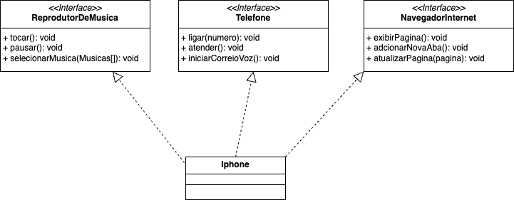

# Implementação simplória de Interfaces

[Projeto proposto](https://github.com/digitalinnovationone/trilha-java-basico/blob/main/desafios/poo/README.md)

Foi utilizado o [Draw.io](https://app.diagrams.net/) com seus respectivos diagramas de UML.